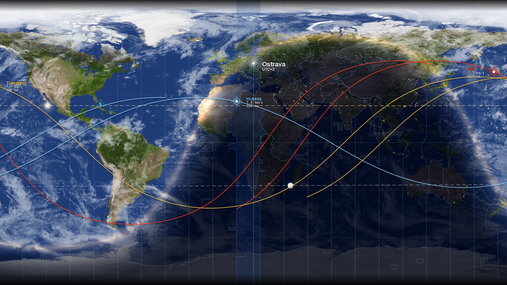

# Penumbra

Živá tapeta plochy s mapou světa **den/noc** — terminátor v aktuálním čase,
soumrak, světla měst, mraky, časová pásma, dráha Slunce i Měsíce (s fází),
polární záře a družice (ISS, Hubble, Tiangong) s dráhou, výškou a rychlostí.
Vzhled laděný do palety NASA (písma Inter + DM Mono).

> *Penumbra* = polostín — soumraková zóna mezi dnem a nocí, kterou appka kreslí.



## Co umí

- **Den/noc** s plynulým soumrakem (civilní / nautický / astronomický)
- **8K satelitní textura** + noční světla měst, antialiasing, vinětace
- **Mraky** (statická textura, volitelně živá z NASA GIBS)
- **Časová pásma** ze skutečných hranic (Natural Earth) + zvýraznění pásma města
- **Vystředění na libovolné město** (výchozí Ostrava) + maják s názvem a UTC posunem
- **Slunce a Měsíc** — subsolární/sublunární bod, přerušované dráhy, fáze Měsíce
- **Polární záře** na noční straně z modelu NOAA OVATION (volitelné)
- **Družice** (ISS, Hubble, Tiangong) — pozemní stopa, terčík, výška a rychlost
- Jemné **vržené stíny** pod popisky, dráhami i značkami; NASA paleta a fonty

## Instalace

```bash
pip install -r requirements.txt
```

`sgp4` je potřeba jen pro družice, `tzdata` jen na Windows (správný letní/zimní
čas). Bez internetu nebo bez `sgp4` se družice a aurora prostě vynechají.

## Spuštění

```bash
python penumbra.py
```

Skript vykreslí jeden obrázek (`penumbra.png`) a nastaví ho jako tapetu plochy
(Windows i macOS). Sám se neobnovuje — frekvenci určuje plánovač (viz níže).

## Nastavení

Všechno se ladí v přehledné sekci na začátku `penumbra.py` (rozcestník v komentáři):

| Skupina | Klíčové volby |
|---|---|
| Střed mapy | `CITY`, `CITIES`, `CENTER_LON` |
| Rozlišení / ořez | `SCREEN`, `MAP_FILL`, `SUPERSAMPLE` |
| Vzhled Země | `USE_TEXTURE`, `NIGHT_BRIGHTNESS`, `LIGHTS_GAIN` |
| Mraky | `CLOUDS`, `CLOUD_OPACITY`, `CLOUDS_LIVE_URL` |
| Časová pásma | `TIMEZONES`, `HIGHLIGHT_CITY_ZONE` |
| Družice | `SHOW_SATELLITES`, `SATELLITES`, `SAT_TRACK_MIN_BEFORE/AFTER` |
| Slunce / Měsíc | `SHOW_SUN_PATH`, `SHOW_MOON`, `SHOW_MOON_PATH`, `PATH_HOURS` |
| Polární záře | `SHOW_AURORA`, `AURORA_GAIN`, `AURORA_COLOR` |
| Písmo | `FONT_MAIN`, `FONT_MONO` |

Další družici přidáš řádkem do `SATELLITES` ve tvaru `("název", NORAD_číslo, (R,G,B))`
(NORAD číslo najdeš na [Celestraku](https://celestrak.org/)).

## Automatické obnovování

**Windows (Plánovač úloh):** vytvoř úlohu spouštějící `python C:\cesta\penumbra.py`
v intervalu např. každých 10 minut.

**macOS / Linux (cron):**

```cron
*/10 * * * * /usr/bin/python3 /cesta/penumbra.py
```

Orientačně: den/noc se znatelně pohne po ~10 min, družice i za 1–2 min
(letí ~7,7 km/s). Jeden render trvá ~13–15 s; TLE družic se cachují ~3 h.

## Struktura projektu

```
Penumbra/
├── penumbra.py            # hlavní skript
├── requirements.txt
├── README.md
└── assets/
    ├── fonts/             # Inter-SemiBold.ttf, DMMono-Medium.ttf
    ├── textures/          # earth_day/night/clouds.jpg (8K)
    └── data/              # timezones.json, land.json
```

Runtime cache (TLE, aurora, živé mraky) se ukládá do `.cache/` (gitignored).

## Assety a licence

- **Textury Země** — [Solar System Scope](https://www.solarsystemscope.com/textures/) (CC BY 4.0; podklady NASA)
- **Písma** — [Inter](https://rsms.me/inter/) a [DM Mono](https://fonts.google.com/specimen/DM+Mono) (SIL Open Font License). Inter a DM Mono jsou písma z NASA Horizon Design System.
- **Hranice pásem a pevnin** — [Natural Earth](https://www.naturalearthdata.com/) (public domain)
- **Dráhy družic (TLE)** — [CelesTrak](https://celestrak.org/) (T. S. Kelso)
- **Polární záře** — [NOAA SWPC](https://www.swpc.noaa.gov/) (model OVATION)

Kód projektu je pod licencí **MIT** (viz [LICENSE](LICENSE)). Přibalené assety
třetích stran se řídí licencemi uvedenými výše.
